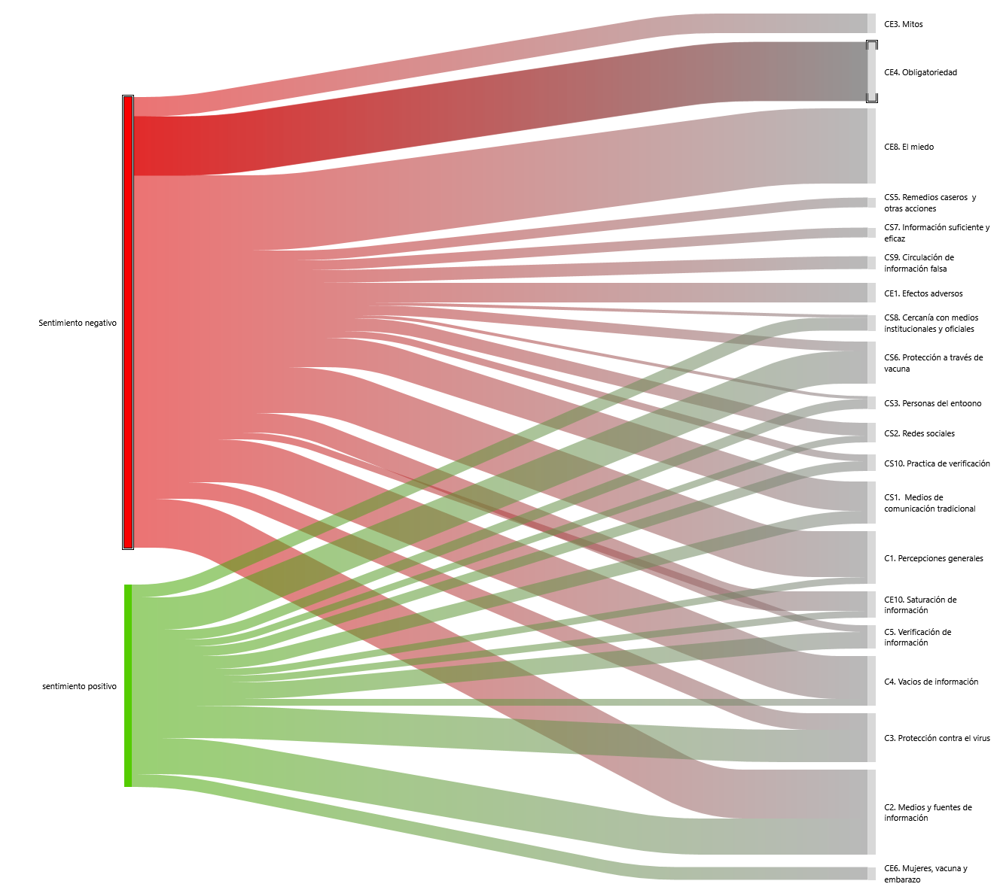

## Concurrencias entre sentimiento  y categorías analíticas

>  Los diagramas de Sankey visualizan los flujos y sus cantidades en relación unas con otras. El grosor de las flechas o líneas indica sus magnitudes, de modo que una flecha más ancha representa un mayor flujo. A lo largo de un proceso, las flechas o líneas de flujo pueden fusionarse o dividirse en distintas etapas. Además, se puede utilizar el color para categorizar diferentes elementos del diagrama o para ilustrar la transición entre distintos estados del proceso.

<figure>
  
  <figcaption>Figura1: Gráfico sankey generado por AtlasTi, 24. concurrencia de sentimientos asociados a la codificacion realizada previamente
</figcaption>
</figure>

Este documento hace parte del estudio **Infodemiología sobre la vacunación contra COVID-19 en localidades de la ciudad de Bogotá**. Mediante la metodología de análisis temático con apoyo del sofware AtlasTi, se identificaron sentimientos expresados por participantes en diecinueve grupos focales y su relación con las diferentes categorias preestablecidas. Este resultado puede ser un insumo de valor para quienes planifican estrategias de comunicación con el objetivo de que puedan brindar información para abordar temáticas que son asociadas con sentimientos negativos, con el propósito de proporcionar una comunicación resolutiva que facilite la generación de nuevos sentidos y significados ante temas complejos. 

A continuación se describen los resultados del análsis: 

En el gráfico sankey  realizado con el sofware ATLAS.ti. 24, se evidencia la concurrencia de sentimientos asociados a la codificacion realizada previamente. Este análisis se realiza con el objetivo de identificar patrones emocionales predominantes en relación con las categorías clave y dar mayor soporte a los argumentos que se han presentado previamente. Dentro del analisis se pudieron encontrar 97 citas de carácter negativo y 38 de cararcter positivo, lo que denota que las narrativas de las personas se encuentran más demarcadas por la incertidumbre y el temor que la esperanza y optimismo.

## Sentimientos Negativos
Los sentimientos negativos predominan en categorías como **CE3 (Mitos), CE4 (Obligatoriedad), CE8 (Miedos) y C4 (Vacíos de información)**. Estas categorías están vinculadas a emociones como ansiedad, pánico, temor, y desconfianza. Palabras recurrentes dentro de las citas incluyen: "ansiedad", "pánico", "temor", "farsa", "forzado",  "malestar",  "rabia", “mal genio” "abrumador" "desgastante". Esto sugiere una preocupación significativa entre las personas, frente a la incertidumbre ocasionada propiamente en los tiempos de la pandemia. Por otro lado se denota la percepción de obligatoriedad como una dura imposicion que les costo a las personas generando mayor desconfianza con el sistema de vacunacion y desconfianza hacia las instituciones. La desinformación también generó preocupacióin y confusión entre las personas. La asociación de estos términos destaca la resistencia y el rechazo hacia la vacunación, motivado tanto por la falta de información veraz como por la circulación de mitos y temores infundados.

## Sentimientos Positivos
En contraste, las categorías **CS6 (Protección a través de la vacuna) y C3 (Protección frente al virus)** muestran una predominancia de sentimientos positivos. Aquí, se percibe confianza y esperanza en el proceso de vacunación, manifestadas en plabras como "descanso", "confianza",  "esperanza" “gratitud” y “solución”. Estas emociones reflejan la valoración positiva de la vacuna como un medio para protegerse y superar la crisis, en especial entre quienes ven la vacunación como una vía para recuperar la normalidad. Además denota la confianza en las instituciones como medios y fuentes confiables de obtener información veraz para la tranquilidad de ellos mismos y las personas de su entorno.
